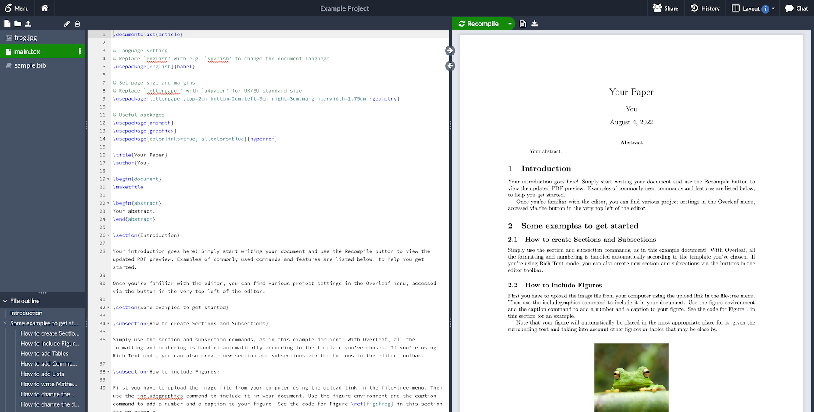

<h1 align="center">
   
  
</h1>

<h4 align="center">An open-source online real-time collaborative LaTeX editor.</h4>

  <a href="https://github.com/overleaf/overleaf/wiki">Wiki</a> •
  <a href="https://www.overleaf.com/for/enterprises">Server Pro</a> •
  <a href="#contributing">Contributing</a> •
  <a href="https://mailchi.mp/overleaf.com/community-edition-and-server-pro">Mailing List</a> •
  <a href="#authors">Authors</a> •
  <a href="#license">License</a>

  Figure 1: A screenshot of a project being edited in Overleaf Community Edition.

#esta es una modificacion propia. para instalar en mac m4.

